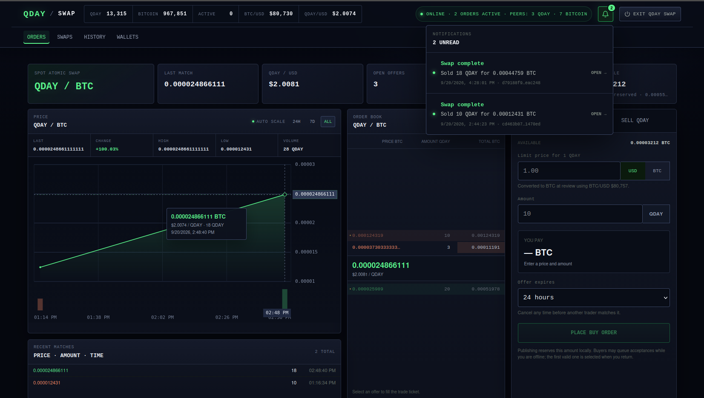

# QDAY SWAP

## DOWNLOAD QDAY SWAP. FUCK KYC.

QDAY Swap is a local, noncustodial application for direct atomic swaps between
QDAY and other blockchains. QDAY/BTC is the first live market. More markets can
use the same application and protocol.



| Platform | Download |
| --- | --- |
| Windows x64 | [QDAY Swap for Windows](https://github.com/petoshi/qday-swap/releases/download/v1.0.0/QDAY-Swap-windows-amd64.zip) |
| Linux x64 | [QDAY Swap for Linux x64](https://github.com/petoshi/qday-swap/releases/download/v1.0.0/QDAY-Swap-linux-amd64.tar.gz) |
| Linux ARM64 | [QDAY Swap for Linux ARM64](https://github.com/petoshi/qday-swap/releases/download/v1.0.0/QDAY-Swap-linux-arm64.tar.gz) |
| macOS | [QDAY Swap for macOS](https://github.com/petoshi/qday-swap/releases/download/v1.0.0/QDAY-Swap-macos-universal.zip) |

See [the installation guide](docs/INSTALL.md) for the exact command on each OS.

The first public market is QDAY/BTC. Litecoin remains the reference
integration because the complete QDAY/LTC protocol has already been exercised
on regtest, including claims, refunds, restarts and reorganizations. The engine
is chain-neutral so new assets are adapters rather than separate applications.

Adapter order:

1. Bitcoin: embedded Neutrino light wallet and atomic swap adapter implemented
2. USDC and ETH on an EVM network
3. XRP
4. Dogecoin
5. Litecoin and Bitcoin Cash

The product has one local interface, one recovery phrase, signed public offers,
exact integer accounting and automatic claim or refund. Open orders may collect
several signed acceptances while the maker is offline. On return, the maker app
selects the first valid one atomically; the selected taker's exact pre-signed
funding transaction can then be relayed without keeping both applications
online. The first public order
book runs at `dex.pqday.com`. It stores signed offers and cancellations and
publishes the protocol plus matched market activity. The first valid signed acceptance is matched
atomically, then an end-to-end encrypted mailbox carries the trade protocol between
the two installed applications. The relay never receives a wallet seed,
signing key, plaintext contract message or general spend authority. Prepared
transactions and claim templates let the parties continue in separate sessions;
every unfinished funded leg still has its unilateral on-chain refund. A peer-to-peer
discovery mesh can replace this first relay when the market is large enough
without changing the signed records.

The local **Wallets** screen shows QDAY and Bitcoin balances, receive addresses
and ordinary withdrawals. Partial sends and MAX both calculate the exact
network fee before the user approves the final transaction. Open orders are
shown separately as locally reserved funds, so they cannot be offered or
withdrawn twice. Recovery export
requires the wallet password; recovery import atomically replaces both local
wallets and is refused while a swap is active.

QDAY uses its native SHA-256 hashlock policy with Ed25519 and SLH-DSA. Each
external adapter locks its asset against the same 32-byte secret using that
chain's native script, escrow or contract mechanism.

## No foreign full-chain downloads

The application runs its own fully validating QDAY node. It does not require
ordinary users to download Bitcoin, Litecoin, Dogecoin, XRP or EVM blockchains.
External adapters use a validating light client where the chain supports one:

- Bitcoin uses proof-of-work headers, compact filters and Merkle proofs.
- Other Bitcoin-family chains use headers and inclusion proofs, with multiple
  peers or proof-serving backends when compact filters are unavailable.
- Ethereum uses a consensus light client plus verified execution proofs. A
  multiple-RPC compatibility mode must be labelled as weaker than verification.
- XRP uses multiple independent validated-ledger sources until a suitable
  embedded verifier is available.

A single unverified explorer or RPC response is never enough to advance a swap
state. Users may optionally connect their own full node for any supported asset.

The current source includes the local wallet application, QDAY/BTC state
machine, durable recovery journal, embedded Bitcoin light client and public
relay. Automated regtest coverage exercises funding, claims, refunds, restarts
and chain reorganizations. Every completed swap remains independently
verifiable on QDAY and Bitcoin.
See [the product plan](docs/PRODUCT.md) and [chain adapter plan](docs/CHAINS.md).

## DEX relay development server

The relay API and embedded protocol/market site can be started locally with:

```sh
go run ./cmd/qday-swap-relay \
  -listen 127.0.0.1:8080 \
  -data ./data/orders.db \
  -network mainnet \
  -public-url https://dex.pqday.com
```

Open `http://127.0.0.1:8080`. See [the relay protocol and API](docs/RELAY.md)
for the canonical signed payload and endpoints.
